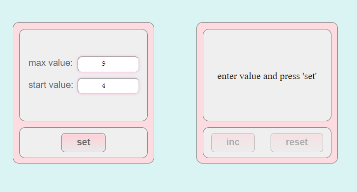
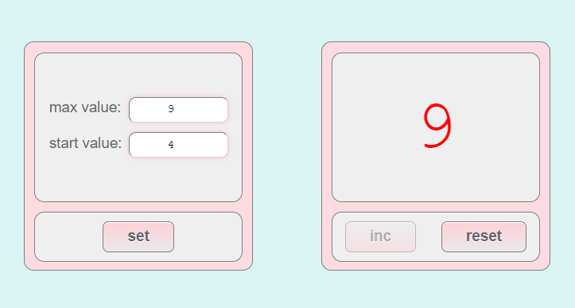
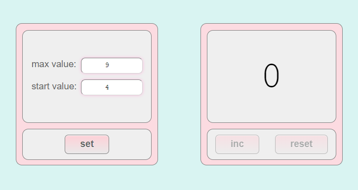
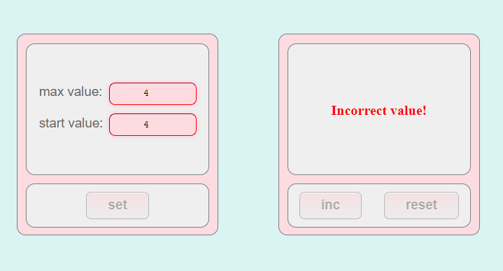

#Counter with 2 desks

Link to gh-pages: https://margokomilfo-dev.github.io/exam-tuesday/

What I used in my project:
- React/Redux
- Hooks 
- Jest
- LocalStorage

 

Pic 1 - Start - read start values from local storage (this: 9, 4, in your case will be:  1, 0)
buttons INC(increment)   and RESET are disabled till you press SET with correct values

Pic 2 - Result work of button INC (increment)  with correct values (from 4 to 9). When counter is end 
(number 9)   - the button INC is getting disabled

Pic 3 - After press Reset button - INC and RESET are getting disabled and right board has number '0'.
Now you   can use only left board.

Pic 4 - Setting values are correct if start value less max value. 
Values can't be less 0 and the same.
